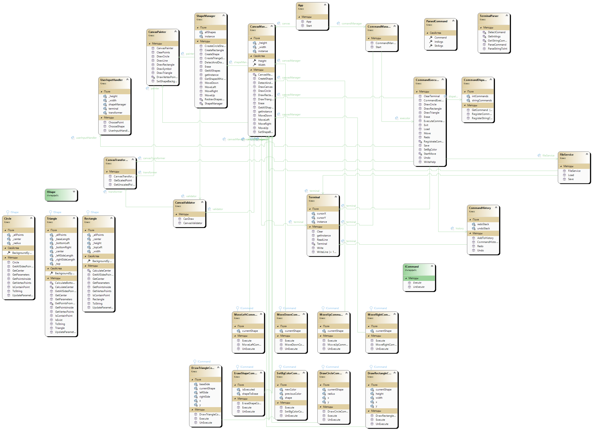

#Lab work №1
Функциональные требования

После запуска приложение должно иметь возможность выполнять следующие функции:
    1. Нарисовать фигуру по введённым параметрам. Эта функция дает пользователю возможность нарисовать одну из 4 фигур (круг треугольник, прямоугольник, квадрат). Для отрисовки фигуры пользователь должен ввести команду с заданными параметрами, после чего фигура появится на переднем плане.
    Для отрисовки фигуры пользователь вводит команду /drawSHAPENAME x, y; parameters
    где parameters:
    - длина стороны для квадрата, 
    - длины длины и ширины для прямоугольника, 
    - длины 3 сторон для треугольника, 
    - радиус для окружности, 
    2. Удалить фигуру. Пользователь может выбрать появившимся курсором точку. Если точка содержится в фигуре, она удалится. В случае того, что точка может быть в нескольких фигурах, появится список всех фигур, содержащих выбранную точку. После выбора, фигура удалится. Для выхода из режима выбора фигуры необходимо нажать клавишу Esc.
    3. Переместить фигуру. После выбора одной из нарисованных фигур пользователь управляет фигурой с помощью клавиатурных стрелок. Для остановки перемещения необходимо нажать клавишу Esc. Если новая позиция выходит за границы холста, перемещение невозможно.
    4. Заполнить фоном фигуру. После выбора фигуры программа спрашивает каким символом необходимо закрасить. Все точки внутри фигуры заменяются введённым символом.
    5. Сохранить комбинацию фигур в файл - эта функция сохраняет все фигуры в файл, путь до которого введёт пользователь с расширением .txt. Если файл поврежден или имеет неверный формат, программа выдаст сообщение об ошибке.
    6. Загрузить из файла - эта функция загружает данные из файла, путь до которого введёт пользователь с расширением .txt. Если файл поврежден или имеет неверный формат, программа выдаст сообщение об ошибке.
    7. Отменить действие - эта функция отменяет последнее действие. Если нет никаких действий, программа сообщит об этом.
    8. Повторить действие - эта функция восстанавливает последнее действие, если она была удалена.Если нет никаких действий, программа сообщит об этом.

